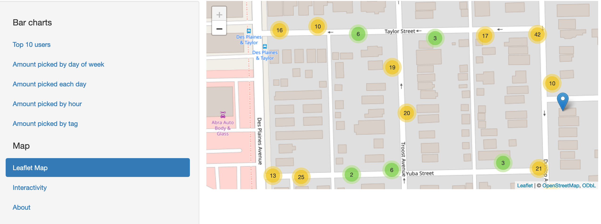

# README for Litterati Analysis Project

# Project Overview

This repository contains a Shiny application for analyzing and visualizing data on litter collection. The app leverages several R libraries to process and present data interactively. It includes features like filtering by tags, users, time of day, and dates, and displays the results in various formats such as tables, bar charts, and maps.
# Key Features

Data Filtering: Users can filter the litter data by tags, usernames, time of day, and dates.
Interactive Visualizations: Includes bar charts for data like top users, litter collection by weekdays, hours, and tags.
User and Tag Analysis: Analyzes and ranks top users and common tags in the litter data.
Temporal Analysis: Provides insights into litter collection patterns over different times of the day and dates.
Geospatial Mapping: Features a Leaflet map to visualize litter data geographically.

# Libraries Used

shiny and shinydashboard: For creating the interactive web app.
ggplot2: For generating visual plots and charts.
lubridate, DT, jpeg, grid: For data manipulation and presentation.
leaflet: For geospatial data visualization.
scales: For plot scaling.

# Installation

To run this application, you need to have R installed on your system. After installing R, you can install the necessary libraries using the following R commands:

R

install.packages(c("shiny", "shinydashboard", "ggplot2", "lubridate", "DT", "jpeg", "grid", "leaflet", "scales"))

Running the Application

Clone the repository and open the R script. Run the script in RStudio or any other R environment. This will launch the Shiny application in your default web browser.
# Data Source

The project uses litter data from Litterati. The data should be in CSV format and placed in the project directory.